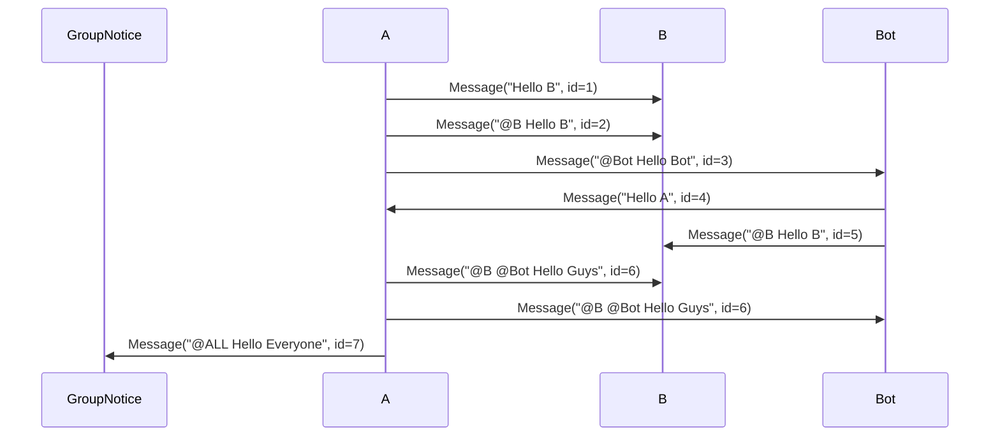

# Mai NEXT 设计文档
Version 0.1.9 - 2025-10-19

## 配置文件设计
- [x] 使用 `toml` 作为配置文件格式
- [x] <del>合理使用注释说明当前配置作用</del>（提案）
- [ ] 使用 python 方法作为配置项说明（提案）
    - [ ] 取消`bot_config_template.toml`
    - [ ] 取消`model_config_template.toml`
### 移除template的方案提案
- [ ] 方案一
```python
from typing import Annotated
from dataclasses import dataclass, field
@dataclass
class Config:
    value: Annotated[str, "配置项说明"] = field(default="default_value")
```
- [ ] 方案二（不推荐）
```python
from dataclasses import dataclass, field
@dataclass
class Config:
    @property
    def value(self) -> str:
        """配置项说明"""
        return "default_value"
```
- [ ] 方案三（个人推荐）
```python
import ast, inspect
class AttrDocBase:
    ...
from dataclasses import dataclass, field
@dataclass
class Config(AttrDocBase):
    value: str = field(default="default_value")
    """配置项说明"""
```
- [ ] 方案四
```python
from dataclasses import dataclass, field
@dataclass
class Config:
    value: str = field(default="default_value", metadata={"doc": "配置项说明"})
```

### 配置文件实现热重载

#### 整体架构设计
- [ ] 文件监视器
    - [ ] 监视文件变化
        - [ ] 使用 `watchdog` 监视配置文件变化（提案）
        - [ ] 备选提案：使用纯轮询监视文件变化
    - [ ] 使用Hash检查文件变化
    - [ ] 防抖处理
- [ ] 配置管理器
    - [ ] 配置文件读取和加载
    - [ ] 重载配置
    - [ ] 管理全部配置数据
    - [ ] `validate_config` 方法
- [ ] 回调管理器
    - [ ] `callback` 注册与注销
    - [ ] 按优先级执行回调（提案）
    - [ ] 错误隔离
    - [ ] 锁机制

#### 工作流程
```
1. 文件监视器检测变化
2. 配置管理器加锁重载
3. 验证新配置 (失败保持旧配置)
4. 更新内存数据
5. 回调管理器按优先级执行回调 (错误隔离)
6. 释放锁
```

#### 回调执行策略
1. 优先级顺序（提案）: 数字越小优先级越高，同优先级异步回调并行执行
2. 错误处理: 单个回调失败不影响其他回调


#### 代码框架

`ConfigManager` - 配置管理器:
```python
import asyncio
import tomlkit
from typing import Any, Dict, Optional
from pathlib import Path

class ConfigManager:
    def __init__(self, config_path: str):
        self.config_path: Path = Path(config_path)
        self.config_data: Dict[str, Any] = {}
        self._lock: asyncio.Lock = asyncio.Lock()
        self._file_watcher: Optional["FileWatcher"] = None
        self._callback_manager: Optional["CallbackManager"] = None
    
    async def initialize(self) -> None:
        """异步初始化，加载配置并启动监视"""
        pass
    
    async def load_config(self) -> Dict[str, Any]:
        """异步加载配置文件"""
        pass
    
    async def reload_config(self) -> bool:
        """热重载配置，返回是否成功"""
        pass
    
    def get_item(self, key: str, default: Any = None) -> Any:
        """获取配置项，支持嵌套访问 (如 'section.key')"""
        pass
    
    async def set_item(self, key: str, value: Any) -> None:
        """设置配置项并触发回调"""
        pass
    
    def validate_config(self, config: Dict[str, Any]) -> bool:
        """验证配置合法性"""
        pass
```

`CallbackManager` - 回调管理器:
```python
import asyncio
from dataclasses import dataclass, field

@dataclass
class CallbackEntry:
    callback: Callable
    priority: int = 100
    enabled: bool = True
    name: str = field(default="")

class CallbackManager:
    def __init__(self):
        self._callbacks: Dict[str, List[CallbackEntry]] = {}
        self._global_callbacks: List[CallbackEntry] = []
    
    def register(
        self, 
        key: str, 
        callback: Callable[[Any], Union[None, asyncio.Future]], 
        priority: int = 100,
        name: str = ""
    ) -> None:
        """注册回调函数，priority为正整数，数字越小优先级越高"""
        pass
    
    def unregister(self, key: str, callback: Callable) -> None:
        """注销回调函数"""
        pass
    
    async def trigger(self, key: str, value: Any) -> None:
        """触发回调，按优先级执行（数字小的先执行），错误隔离"""
        pass
    
    def enable_callback(self, key: str, name: str) -> None:
        """启用指定回调"""
        pass
    
    def disable_callback(self, key: str, name: str) -> None:
        """禁用指定回调"""
        pass
```

对于CallbackManager中的优先级功能说明：

- 数字越小优先级越高
- 为什么要有优先级系统：
    - 理论上来说，在热重载配置之后，应该要通过回调函数管理器触发所有回调函数，模拟启动的过程，类似于“重启”
    - 而优先级模块是保证某一些模块的重载顺序一定是晚于某一些地基模块的
    - 例如：内置服务器的启动应该是晚于所有模块，即最后启动

`FileWatcher` - 文件监视器:
```python
import asyncio
from watchdog.observers import Observer
from watchdog.events import FileSystemEventHandler
from pathlib import Path

class FileWatcher:
    def __init__(self, file_path: Path, debounce_ms: int = 500):
        self.file_path: Path = file_path
        self.debounce_ms: int = debounce_ms
        self._observer: Optional[Observer] = None
        self._on_change_callback: Optional[Callable] = None
        self._debounce_task: Optional[asyncio.Task] = None
    
    def start(self, on_change: Callable) -> None:
        """启动文件监视"""
        pass
    
    def stop(self) -> None:
        """停止文件监视"""
        pass
    
    async def _debounced_change(self) -> None:
        """防抖处理"""
        pass
```

## 消息部分设计
解决原有的将消息类与数据库类存储不匹配的问题，现在存储所有消息类的所有属性

完全合并`stream_id`和`chat_id`为`chat_id`，规范名称

`chat_stream`重命名为`chat_session`，表示一个会话

### 消息类设计
- [ ] 支持并使用maim_message新的`SenderInfo`和`ReceiverInfo`构建消息
    - [ ] 具体使用参考附录
- [ ] 适配器处理跟进该更新
- [ ] 修复适配器的类型检查问题
- [ ] 设计更好的平台消息ID回传机制
    - [ ] 考虑使用事件依赖机制
### 图片处理系统
- [ ] 规范化Emojis与Images的命名，统一保存
### 消息到Prompt的构建（提案）
- [ ] <del>类QQ的时间系统（即不是每条消息加时间戳，而是分大时间段加时间戳）</del>(此功能已实现，但效果不佳)
- [ ] 消息编号系统（已经有的）
- [ ] 思考打断，如何判定是否打断？
    - [ ] 如何判定消息是连贯的（MoFox: 一个反比例函数？？？太神秘了）
### 消息进入处理
使用轮询机制，每隔一段时间检查缓存中是否有新消息

---

## 数据库部分设计
合并Emojis和Images到同一个表中

数据库ORM应该使用SQLModel而不是peewee（墨：peewee我这辈子都不会用它了）
### 数据库缓存层设计
将部分消息缓存到内存中，减少数据库访问，在主程序处理完之后再写入数据库

要求：对上层调用保持透明
- [ ] 数据库内容管理类 `DatabaseManager`
    - [ ] 维护数据库连接
    - [ ] 提供增删改查接口
    - [ ] 维护缓存类 `DatabaseMessageCache` 的实例

- [ ] 缓存类 `DatabaseMessageCache`
    - [ ] **设计缓存失效机制**
    - [ ] 设计缓存更新机制
        - [ ] `add_message`
        - [ ] `update_message` （提案）
        - [ ] `delete_message`

- [ ] 与数据库交互部分设计
    - [ ] 维持现有的数据库sqlite
    - [ ] 继续使用peewee进行操作
### 消息表设计
- [ ] 设计内部消息ID和平台消息ID两种形式
- [ ] 临时消息ID不进入数据库
- [ ] 消息有关信息设计
    - [ ] 消息ID
    - [ ] 发送者信息
    - [ ] 接收者信息
    - [ ] 消息内容
    - [ ] 消息时间戳
    - [ ] 待定
### Emojis与Images表设计
- [ ] 设计图片专有ID，并作为文件名
### Expressions表设计
- [ ] 待定
### 表实际设计
#### ActionRecords 表
- [ ] 动作唯一ID `action_id`
- [ ] 动作执行时间 `action_time`
- [ ] 动作名称 `action_name`
- [ ] 动作参数 `action_params` （JSON格式存储）（原`action_data`）
---

## 数据模型部分设计
- [ ] <del>Message从数据库反序列化，不再使用额外的Message类</del>（放弃）
- [ ] 设计 `BaseModel` 类，作为所有数据模型的基类
    - [ ] 提供通用的序列化和反序列化方法（提案）

---

## 核心业务逻辑部分设计
### Prompt 设计
将Prompt内容彻底模块化设计
- [ ] 设计 Prompt 类
    - [ ] `__init__(self, template: list[str], *, **kwargs)` 维持现有的template设计，但不进行format，直到最后传入LLM时再进行render
        - [ ] `__init__`中允许传入任意的键值对，存储在`self.context`中
        - [ ] `self.prompt_name` 作为Prompt的名称
        - [ ] `self.construct_function: Dict[str, Callable | AsyncCallable]` 构建Prompt内容所需的函数字典
            - [ ] 格式：`{"block_name": function_reference}`
        - [ ] `self.content_block: Dict[str, str]`: 实际的Prompt内容块
            - [ ] 格式：`{"block_name": "Unrendered Prompt Block"}`
    - [ ] `render(self) -> str` 使用非递归渲染方式渲染Prompt内容
    - [ ] `add_construct_function(self, name: str, func: Callable | AsyncCallable, *, suppress: bool = False)` 添加构造函数
        - [ ] 实现重名警告/错误（偏向错误）
        - [ ] `suppress`: 是否覆盖已有的构造函数
    - [ ] `remove_construct_function(self, name: str)` 移除指定名称的构造函数
    - [ ] `add_block(self, prompt_block: "Prompt", block_name: str, *, suppress: bool = False)` 将另一个Prompt的内容更新到当前Prompt中
        - [ ] 实现重名属性警告/错误（偏向错误）
        - [ ] 实现重名构造函数警告/错误（偏向错误）
        - [ ] `suppress`: 是否覆盖已有的内容块和构造函数
    - [ ] `remove_block(self, block_name: str)` 移除指定名称的Prompt块
- [ ] 设计 PromptManager 类
    - [ ] `__init__(self)` 初始化一个空的Prompt管理器
    - [ ] `add_prompt(self, name: str, prompt: Prompt)` 添加一个新的Prompt
        - [ ] 实现重名警告/错误（偏向错误）
    - [ ] `get_prompt(self, name: str) -> Prompt` 根据名称获取Prompt
        - [ ] 实现不存在时的错误处理
    - [ ] `remove_prompt(self, name: str)` 移除指定名称的Prompt
        - [ ] 系统 Prompt 保护
    - [ ] `list_prompts(self) -> list[str]` 列出所有已添加的Prompt名称
### 内建好奇插件设计
- [ ] 设计“麦麦好奇”插件
    - [ ] 解决麦麦乱好奇的问题
        - [ ] 好奇问题无回复清理
        - [ ] 好奇问题超时清理
        - [ ] 根据聊天内容选择个性化好奇问题
        - [ ] 好奇频率控制

---

## 插件系统部分设计
### <del>设计一个插件沙盒系统</del>（放弃）
### 插件管理
- [ ] 插件管理器类 `PluginManager` 的更新
    - [ ] 重写现有的插件文件加载逻辑，精简代码，方便重载
    - [ ] 学习AstrBot的基于子类加载的插件加载方式，放弃@register_plugin（提案）
        - [ ] 直接 breaking change 删除 @register_plugin 函数，不保留过去插件的兼容性（提案）
    - [ ] 设计插件重载系统
        - [ ] 插件配置文件重载
            - [ ] 复用`FileWatcher`实现配置文件热重载
        - [ ] 插件代码重载
            - [ ] 从插件缓存中移除此插件对应的模块
                - [ ] 从组件管理器中移除该插件对应的组件
            - [ ] 重新导入该插件模块
    - [ ] 其余细节待定
- [ ] 组件管理器类 `ComponentManager` 的更新
    - [ ] 配合插件重载系统的更好的组件管理代码
    - [ ] 组件全局控制和局部控制的平级化（提案）
        - [ ] 重新设计组件注册和注销逻辑，分离激活和注册
    - [ ] 可以修改组件的属性
    - [ ] 组件系统卸载
        - [ ] 联动插件卸载（方便重载设计）
    - [ ] 其余细节待定
- [ ] 因重载机制设计的更丰富的`plugin_meta`和`component_meta`
    - [ ] `component_meta`增加`plugin_file`字段，指向插件文件路径，保证重载时组件能正确更新
    - [ ] `plugin_meta`增加`sub_components`字段，指示该插件包含的组件列表，方便重载时更新
        - [ ] `sub_components`内容为组件类名列表
### 插件激活方式的动态设计
- [ ] 设计可变的插件激活方式
    - [ ] 直接读写类属性`activate_types`
### 真正的插件重载
- [ ] 使用上文中提到的配置文件热重载机制
    - [ ] FileWatcher的复用
### 传递内容设计
对于传入的Prompt使用上文提到的Prompt类进行管理，方便内容修改避免正则匹配式查找
### MCP 接入（大饼）
- [ ] 设计 MCP 适配器类 `MCPAdapter`
    - [ ] MCP 调用构建说明Prompt
    - [ ] MCP 调用内容传递
    - [ ] MCP 调用结果处理
### 工具结果的缓存设计
可能的使用案例参考[附录-工具缓存](#工具缓存可能用例)
- [ ] `put_cache(**kwargs, *, _component_name: str)` 方法
    - [ ] 设计为父类的方法，插件继承后使用
    - [ ] `_component_name` 指定当前组件名称，由MaiNext自动传入
    
- [ ] `get_cache` 方法
- [ ] `need_cache` 变量管理是否调用缓存结果
    - [ ] 仅在设置为True时为插件创立缓存空间
### Events依赖机制（提案）
通过Events的互相依赖完成链式任务
### 正式的插件依赖管理系统
- [ ] requirements.txt分析
- [ ] python_dependencies分析
- [ ] 自动安装（提案）
- [ ] plugin_dependencies分析
### 插件系统API更改
#### Events 设计
- [ ] 设计events.api
    - [ ] `emit(type: EventType | str, * , **kwargs)` 广播事件，使用关键字参数保证传入正确
#### 组件控制API更新
- [ ] 增加可以更改组件属性的方法
    - [ ] 验证组件属性的存在
    - [ ] 修改组件属性
#### 全局常量API设计
- [ ] 设计 `api.constants` 模块
    - [ ] 提供全局常量访问
    - [ ] 设计常量注册和注销方法
    - [ ] 系统内置常量通过`dataclass`的`frozen=True`实现不可变
    - [ ] 方便调用设计
```python
from dataclasses import dataclass
@dataclass(frozen=True)
class SystemConstants:
    VERSION: str = "xxx"
    ADA_PLUGIN: bool = True

SYSTEM_CONSTANTS = SystemConstants()
```

---

## 表达方式模块设计
在0.11.x版本对本地模型预测的性能做评估，考虑使用本地朴素贝叶斯模型来检索
降低延迟的同时减少token消耗
需要给表达方式一个负反馈的途径

---
## 加入测试模块，可以通过通用测试集对对话内容进行评估
## 加入更好的基于单次思考的Log

---

## 记忆系统部分设计
启用LPMM系统进行记忆构建，将记忆分类为短期记忆，长期记忆，以及知识
将所有内容放到同一张图上进行运算。

### 时间相关设计
- [ ] 尝试将记忆系统与时间系统结合
    - [ ] 可以根据时间查找记忆
    - [ ] 可以根据时间删除记忆
- [ ] 记忆分层
    - [ ] 即刻记忆
    - [ ] 短期记忆
    - [ ] 长期记忆
    - [x] 知识
    - [ ] 细节待定，考虑心理学相关方向
---

## API 设计（合并到插件系统部分，待定）
主体合并到插件系统部分
### API 设计细则
#### 配置文件
- [ ] 使用`tomlkit`作为配置文件解析方式
- [ ] 解析内容
    - [ ] 注释
    - [ ] 保持原有格式

---

## LLM UTILS设计
多轮对话设计
### FUNCTION CALLING设计（提案）
对于tools调用将其真正修正为function calling，即返回的结果不是加入prompt形式而是使用function calling的形式[此功能在tool前处理器已实现，但在planner效果不佳，因此后弃用]
- [ ] 使用 MessageBuilder 构建function call内容
    - [ ] （提案）是否维护使用同一个模型，即选择工具的和调用工具的LLM是否相同
        - [ ] `generate(**kwargs, model: Optional[str] = None)` 允许传入不同的模型
- [ ] 多轮对话中，Prompt不重复构建减少上下文
### 网络相关内容提案
增加自定义证书的导入功能
- [ ] 允许用户传入自定义CA证书路径
- [ ] 允许用户选择忽略SSL验证（不推荐）

---

## 内建WebUI设计
⚠️ **注意**: 本webui设计仅为初步设计，方向为展示内建API的功能，后续应该分离到另外的子项目中完成
### 配置文件编辑
根据API内容完成
### 插件管理
### log viewer
通过特定方式获取日志内容（只读系统，无法将操作反向传递）
### 状态监控
1. Prompt 监控系统
2. 请求监控系统
    - [ ] 请求管理（待讨论）
    - [ ] 使用量
3. 记忆/知识图监控系统（待讨论）

## 自身提供的MCP设计（提案）
- [ ] 提供一个内置的MCP，作为插件系统的一个组件
- [ ] 该MCP可以对麦麦自身的部分设置进行更改
    - [ ] 例如更改Prompt，添加记忆，修改表达方式等

---

# 提案讨论
- MoFox 在我和@拾风的讨论中提出把 Prompt 类中传入构造函数以及构造函数所需要的内容
- [ ] 适配器插件化: 省下序列化与反序列化，但是失去解耦性质
- [ ] 可能的内存泄露问题
    - [ ] 垃圾回收
- [ ] 数据库模型提供通用的转换机制，转为DataModel使用
- [ ] 插件依赖的自动安装
- [ ] 热重载系统的权重系统是否需要

---

# PYTEST设计
设计一个pytest测试系统，在代码完成后运行pytest进行测试

---

# 依赖管理
已经完成，要点如下：
- 使用 pyproject.toml 和 requirements.txt 管理依赖
- 二者应保持同步修改，同时以 pyproject.toml 为主（建议使用git hook）

# 附录
## Maim_Message 新版使用计划
SenderInfo: 将作为消息来源者
ReceiverInfo: 将作为消息接收者
尝试更新MessageBaseInfo的sender_info和receiver_info为上述两个类的列表（提案）
给出样例如下
群聊

上述消息的Info如下
| Message ID | SenderInfo | ReceiverInfo |
|-|-----|-----|
| 1 | [A] |  NULL |
| 2 | [A] | [B] |
| 3 | [A] | [Bot] |
| 4 | [Bot] | [A] |
| 5 | [Bot] | [B] |
| 6 | [A] | [B, Bot] |
| 7 | [A] | [ALL*] |

*ALL为一个特殊类型，尝试用`user_id="all"`表示

Bot可以通过ReceiverInfo判断自己是否被提及，同时在ReceiverInfo表明自己回复的对象

## 工具缓存可能用例
考虑一个天气插件，将时间按照半小时进行划分，即每半小时查询一次天气，半小时内的查询均使用缓存结果。
- `need_cache` 设置为 True 表示使用缓存结果
- `put_cache` 在查询天气后将结果`{<time>: <result>}` 存入缓存